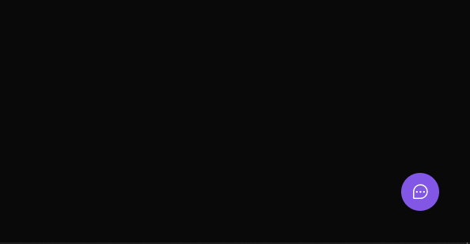
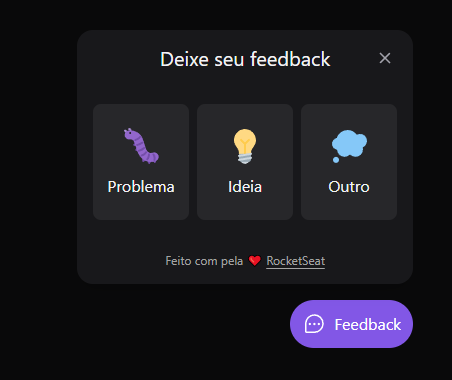
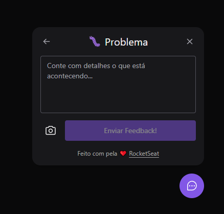
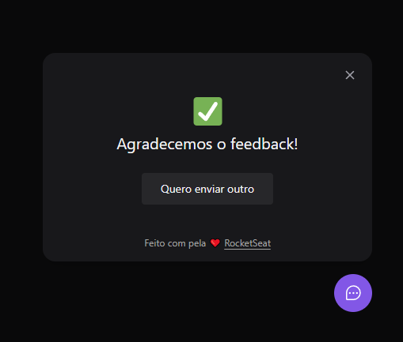

[](https://github.com/ikaroamorim/feedget/commits/master)

[](https://github.com/ikaroamorim/feedget/stargazers)

<h1 align="center">Feedget</h1>

<p align="center">
 <a href="#description">Project Description</a> •
 <a href="#instalation">Instalation</a> • 
 <a href="#technologies">Tecnologies</a> • 
 <a href="#autor">Author</a> • 
 <a href="#images">Images</a>
</p>

<a name="description"></a>
## 💻 Project Description
Feedget is a application that helps yoy to provide feedback on sites and screenshot whithout changing screen. It ofers you 3 categories of feedbacks that you can write a message and send a screenshot.
 The app is delivered in a web version that is hosted on Vercel and a mobile version in react Native, and its backend done in Node.js is hosted in Railway. 
This project were elaborated in Next Level Week Return from [RocketSeat](https://www.rocketseat.com.br/)

Visit the project: [Site Hosted in Vercel](https://feedget-ikaroamorim.vercel.app/)


<a name="instalation"></a>
## 📦 Instalation

### Prerequisites
It is a simple webpage, you can clone the project or in your computer and run in the browser or run a tool like Live Server of Visual Studio Code.
You can also just access the online version through GitHub Pages
Befor you begin you'll need the following tools:

[Git](https://git-scm.com)
[Node](https://nodejs.org/en/)

### Local Instalation

```bash
# clone the repository
$ git clone https://github.com/ikaroamorim/feedget.git

# Access each folder for (back-end, front-end or mobile)
$ cd web
$ cd server
$ cd mobile

# Install dependencies
$ yarn install
or
$ npm install

# Run the app in development mode
##web and server
$ npm run dev
or
$ yarn dev
## mobile 
$ expo start

```


<a name="technologies"></a>
## 🛠 Tecnologies

The following resources are used in this project
- [React](https://pt-br.reactjs.org/)
- [Sass](https://sass-lang.com/)
- [TypeScript](https://www.typescriptlang.org/)
- [tailwindcss](https://tailwindcss.com/)

<a name="autor"></a>
## 👨‍💻 Autor
<a href="https://www.linkedin.com/in/ikaroamorimesilva/">
 
 <br />
 <sub><b>Ikaro Amorim e Silva</b></sub>
 </a>

Done with ❤️ by Ikaro Amorim e Silva

[](https://twitter.com/ikaroamorim) [](https://www.linkedin.com/in/ikaroamorimesilva/) 
[](mailto:ikaro.amorim@gmail.com)

<a name="images"></a>
## 🌍 Images and Videos

<p align="center">
   
</p>
<p align="center">
   
</p>
<p align="center">
   
</p>
<p align="center">
   
</p>
